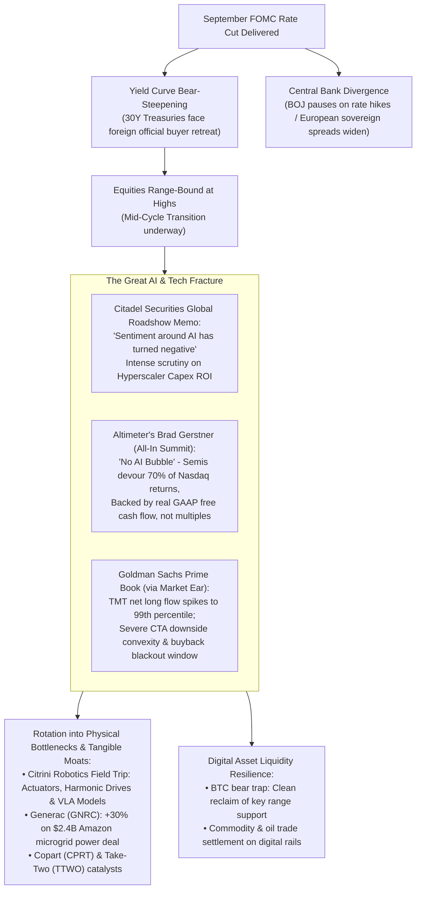
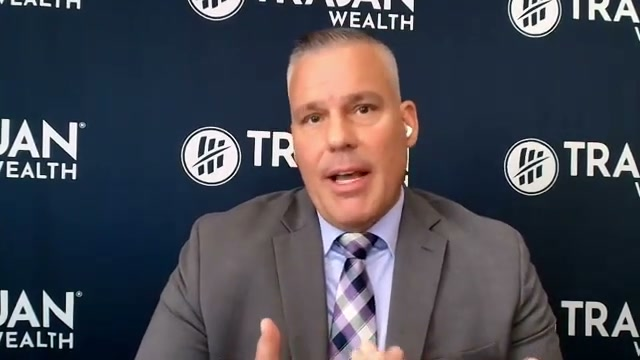
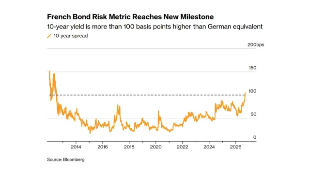
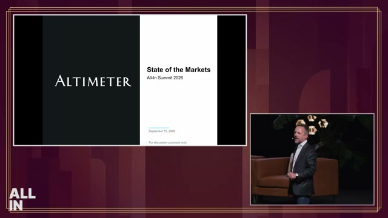
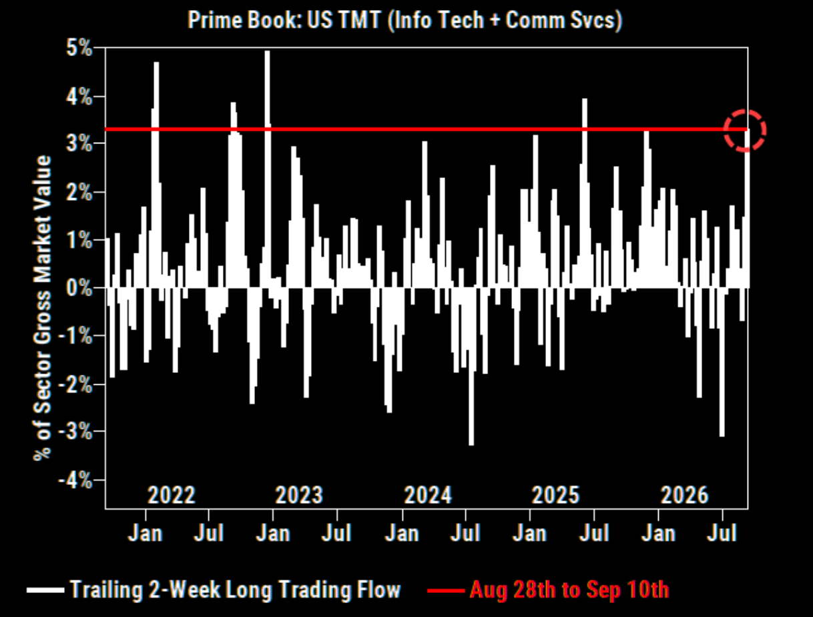
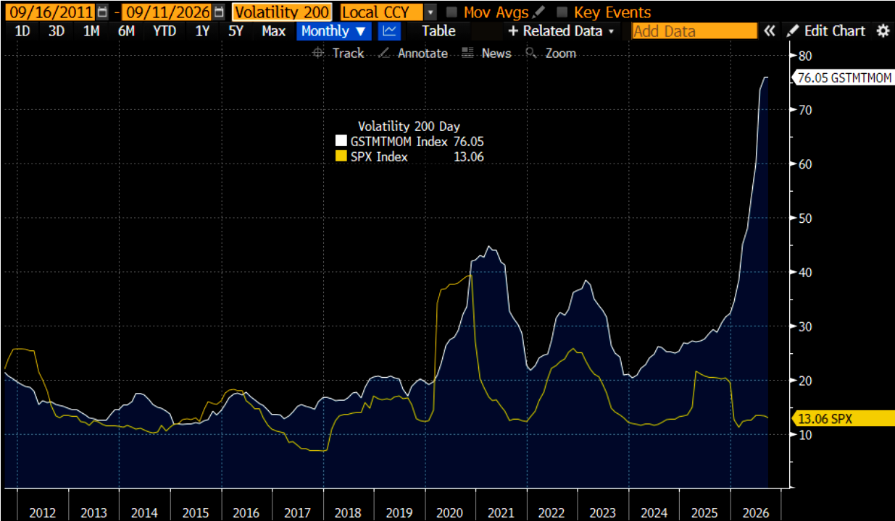
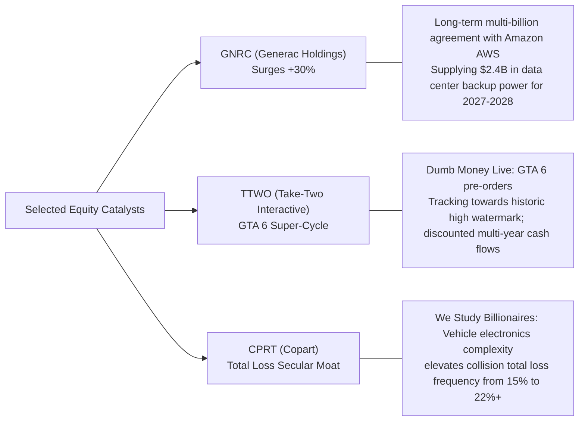
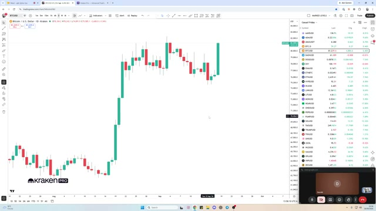
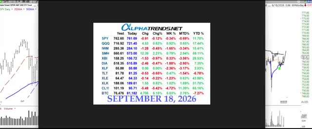
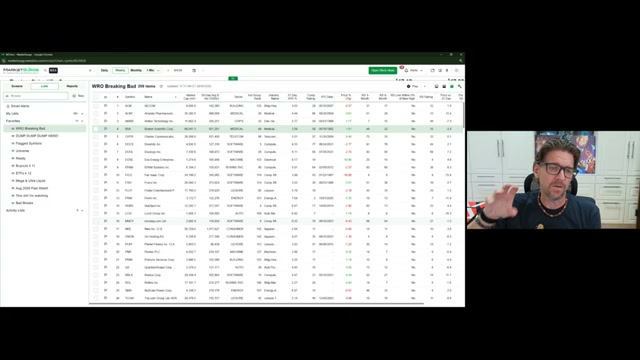

# Market Weekly: Macro & Multi-Asset Intelligence Briefing
> **Language Switch**: **English (Original)** | [中文版本 (Chinese Mirror)](./README_zh.md)  
> **Coverage Period**: September 13, 2026 – September 20, 2026  
> **Source Coverage**: 42 curated items across the Market universe (38 in-depth video podcasts + 4 flagship institutional research memos)  
> **Methodology**: Native primary-source synthesis | High-resolution timestamped video frame capture & native institutional chart citations

---

## Executive Summary: Macro Clock & Key Market Fault Lines

The past week marked a critical inflection point across global markets. As the Federal Reserve's long-anticipated rate-cutting cycle officially commenced, broad-based euphoria was conspicuously absent. Instead, markets witnessed severe internal dispersion: a bear-steepening sovereign yield curve, an abrupt institutional chill on Artificial Intelligence monetization, and a violent momentum fracture inside mega-cap technology.

---

## 1. Global Central Banking & Sovereign Debt Liquidity Disruption

### 1.1 September FOMC Debrief: Terminal Rate Anchors & Economic Projections
The Federal Reserve officially commenced its easing cycle this week. Former Federal Reserve senior trader **Joseph Wang** ([September 2026 FOMC Debrief](https://www.youtube.com/watch?v=AeZskmC_MrM)) analyzed the policy statement, dot plot shifts, and Powell's press conference:
- **Terminal Rate Floor**: The median dot plot trajectory and long-term neutral rate assumptions ($r^*$) continued to migrate upward. The terminal rate is increasingly anchored around **3.00% – 3.25%**, signaling that the Fed views this as a mid-cycle recalibration rather than emergency stimulus.
- **Inflation Stickiness vs. Labor Resilience**: In [Why the Fed May Have Further to Go](https://www.youtube.com/watch?v=W2U5lAksLfw), Morgan Stanley's US Economics team stressed that persistent services inflation and resilient corporate balance sheets mean policy rates will remain in restrictive territory ("Higher-for-Longer") far longer than interest rate futures currently price in.

### 1.2 The 30-Year Treasury Conundrum: Where Have the Long-End Buyers Gone?
While policy rates fell, the long end of the US Treasury curve failed to rally, reflecting an acute supply-demand breakdown. On **The Monetary Matters Network**, Trojan Wealth founder **David Busch** ([Why The 30-Year Treasury Lost Its Biggest Buyers](https://www.youtube.com/watch?v=afFbc9ihr3k)) provided a granular breakdown of auction dynamics:

  
*Figure 1: David Busch dissects foreign reserve managers' retreat from long-duration US Treasuries ([Watch at 02:30](https://www.youtube.com/watch?v=afFbc9ihr3k&t=150s))*

- **Foreign Reserve Managers Retreat**: Foreign central banks and sovereign wealth funds—historically the price-insensitive anchor buyers of 30-year paper—have pulled back due to FX defense, trade tensions, and geopolitical diversification.
- **Structural Surge in Term Premium**: Facing annual US federal budget deficits exceeding \$1.8 trillion and an aggregate debt load above \$40 trillion, domestic pension and insurance funds require substantially higher term premiums to absorb 30-year issuance, resulting in bear steepening across the curve.

### 1.3 Non-US Central Bank Shifts: BOJ Hold & European Sovereign Credit Spreads
In [Markets Weekly September 19, 2026](https://www.youtube.com/watch?v=WnMDoth8dNs), Joseph Wang mapped key global spillover risks:

| Institution / Sovereign | Key Action | Market Implication | Timestamp Reference |
| :--- | :--- | :--- | :---: |
| **Bank of Japan (BOJ)** | Governor Ueda kept rates unchanged and struck a dovish tone, dampening expectations for imminent hikes | The yen rally stalled; the violent yen carry trade unwind took a breather, averting immediate cross-market margin liquidations | [Watch at 01:15](https://www.youtube.com/watch?v=WnMDoth8dNs&t=75s) |
| **Bank of England (BOE)** | Kept policy rate unchanged, fine-tuned quantitative tightening (QT) schedule | Sticky UK services inflation leaves BOE cautious, sustaining GBP resilience against USD | [Watch at 05:03](https://www.youtube.com/watch?v=WnMDoth8dNs&t=303s) |
| **French Sovereign Debt** | Political fragmentation and budget deficit impasses drove 10-year French OAT-Bund spreads to new cycle highs | Sovereign credit risk repricing in Europe, prompting defensive flows into Bunds, US short-term paper, and Gold | [Watch at 09:30](https://www.youtube.com/watch?v=WnMDoth8dNs&t=570s) |

 

 
<em>Figure 2: Joseph Wang analyzes the widening French OAT-Bund spread and European sovereign risk (<a href="https://www.youtube.com/watch?v=WnMDoth8dNs&t=570s">Watch at 09:30</a>)</em>

---

## 2. Equities in the Crosshairs: The Great AI Debate & Quantitative Flow Fragility

The debate over the sustainability of Big Tech capital expenditure reached fever pitch this week, contrasting on-the-ground institutional fatigue with venture capital conviction.

### 2.1 The Bearish Warning: Citadel Securities Global Roadshow Intelligence
**Citadel Securities** published its global roadshow dispatch [2H September: Getting Closer](https://www.citadelsecurities.com/news-and-insights/global-market-intelligence/2h-september-getting-closer/), delivering a sobering assessment of institutional positioning:
> *"I am currently on a multi-country global roadshow, and the biggest change I have noticed is how quickly sentiment around AI has turned negative. That does not mean we think the September weakness is finished. The supply/demand setup into month-end remains unfavorable, the technical backdrop is still working against equities, and we continue to think equities can trade lower over the next two weeks..."*

Citadel identified three decisive shifts in client conversations:
1. **Pivot from Compute Arms Race to ROI Rigor**: Institutional investors are increasingly uncomfortable with hundreds of billions in Hyperscaler depreciation without clear enterprise ARR monetization.
2. **Defensive Vulnerability in Core Moats**: Concerns that AI Agents and open-source models are actively fragmenting traditional search, ad inventory, and incumbent SaaS seats.
3. **Extreme Positioning Crowding**: The Magnificent 7 are no longer insulated from macro rotation; the FOMC cut served as a liquidity event for trimming crowded winners.

### 2.2 The Bullish Counter: Altimeter's Brad Gerstner at All-In Summit
Speaking at the **All-In Summit 2026**, Altimeter founder **Brad Gerstner** ([Brad Gerstner: No AI Bubble, Semis Eat the Nasdaq](https://www.youtube.com/watch?v=PJrntzMA4iQ)) directly rebutted the bubble narrative with granular market data:

  
*Figure 3: Brad Gerstner presents Altimeter's State of the Markets at All-In Summit ([Watch at 02:00](https://www.youtube.com/watch?v=PJrntzMA4iQ&t=120s))*

- **Earnings Expansion, Not Multiple Expansion**:
  > *"This is not about multiple expansion. This is an earnings-driven market expansion. We've seen multiple contraction this year. Earnings are up 26%, driven heavily by AI infrastructure, but the multiple on the Nasdaq and S&P is actually down. Look at Nvidia trading at 14 times next year's fully taxed GAAP earnings. This is no bubble like it was in 2000."*
- **Semis Eat the Nasdaq**:
  > *"Semiconductors are 70% of the Nasdaq's return. 70% of the return... In blue you have hyperscaler capex; in orange you have the free cash flow of the semiconductor companies. Their capex is almost dollar-for-dollar free cash flow to the infrastructure companies."*
- **The Take-Off Lag**: While physical infrastructure deployers lead by 18-24 months, application-layer software monetization follows an S-curve adoption pattern. Pauses in investor sentiment offer generational entry points for compounders.

### 2.3 Microstructure Warning: Goldman Sachs Prime Book via Market Ear
Quantitative flow monitor **market ear** ([Momentum Breaks, CTA Downside Convexity Builds](https://themarketear.com)) revealed acute positioning vulnerability through Goldman Sachs Prime Brokerage data:

| Indicator | Observed Level | Tactical Implication |
| :--- | :--- | :--- |
| **GS TMT Net Long Inflow** | Surged to the **99th historical percentile** over trailing 2 weeks (Figure 4) | Extreme crowding as institutional capital treated mega-cap tech as a cash-surrogate hedge |
| **TMT Momentum Volatility (GSTMTMOM)** | 200-day rolling volatility spiked to **76.05**, vs. S&P 500 volatility at 13.06 (Figure 5) | Violent internal dispersion; individual tech leaders triggering sharp multi-standard-deviation selloffs |
| **CTA Convexity & Buyback Blackout** | Systematic trend-followers sitting on asymmetric downside triggers during the pre-earnings corporate buyback blackout | Absence of daily corporate buyback bids amplifies gap-down severity if key moving averages break |

 

 
<em>Figures 4 & 5: Goldman Sachs Prime Book shows TMT 2-week flow at 99th percentile extreme (Left) and TMT volatility at historic highs (Right)</em>

---

## 3. Industry Deep Dives: Robotics Tipping Point & Single-Stock Alpha

With index-level momentum stalling, smart money rotated into tangible physical bottlenecks and resilient secular business models.

### 3.1 Citrini Research Field Trip: The Humanoid Robotics Tipping Point
Independent research boutique **Citrini Research** published a landmark investigation, [Robotics Tipping Point: A Citrini Field Trip](https://citriniresearch.substack.com/p/robotics-tipping-point-a-citrini-field-trip):

  
*Figure 6: Citrini Research inspects precision dexterous hands and high-torque actuator engineering on site*

- **The Real Mechanical Bottlenecks**: The primary constraint on humanoid robotics scaling is not compute or simulation, but mechanical physics: **dexterous hand actuators**, **miniature harmonic drive speed reducers**, and **6-axis force/torque sensors**.
- **The Cost Deflation Curve**: Japanese and Chinese precision machining supply chains are compressing per-joint actuator costs from several thousand dollars down to the low hundreds.
- **Physical Generalization Crossing 95%**: Leveraging Vision-Language-Action (VLA) foundation models, success rates in real-world electronics assembly tasks improved from ~70% to >95% over the last two quarters.
- **Investment Vector**: Highest risk-adjusted alpha resides not in capital-intensive OEM integrators, but in the near-monopoly component suppliers: frameless torque motors, harmonic gears, and micro-precision bearings.

### 3.2 Single-Stock Catalysts & Company Teardowns

- **Generac (GNRC) —— AI's Power Bottleneck Monetized**:
  - Seeking Alpha ([Amazon Supercharges Generac](https://www.youtube.com/watch?v=d_cGhNN7kZI)) highlighted GNRC's 30%+ surge following its $2.4B supply agreement with Amazon AWS. The market's anxiety over grid interconnection delays has directly turned into contracted hardware backlog for industrial generators and microgrids.
- **Take-Two Interactive (TTWO) —— Multi-Year Gaming Catalyst**:
  - Dumb Money Live ([GTA 6 Has Me Buying Take-Two](https://www.youtube.com/watch?v=nt_-lnlGmgU)) evaluated the gaming entertainment cycle. With GTA 6 marketing milestones approaching, pre-order bookings are projected to establish a new industry record, providing defensive secular growth detached from macro consumer weakness.
- **Copart (CPRT) —— The Compounding Machine**:
  - We Study Billionaires ([Copart Stock: Is CPRT now a Buy?](https://www.youtube.com/watch?v=2TenulJCKVQ)) conducted a valuation teardown of the salvage auction monopoly. As modern vehicle sensor and battery complexity drives total loss frequency to historic highs (22%+), insurance carriers are pushed to liquidate salvage through Copart's marketplace, providing inflation-resistant fee streams.

---

## 4. Digital Assets & Alternative Liquidity Dynamics

Crypto markets staged a significant technical and narrative recovery this week, weathering early downside pressure and reclaiming multi-month support.

### 4.1 Bitcoin Bear Trap Confirmed: TechnicalRoundup Execution
Leading crypto trading podcast **TechnicalRoundup** ([Bitcoin Bears Had Their Chance](https://www.youtube.com/watch?v=1e2J5t5frSo)) broke down Bitcoin's daily market structure on Kraken Pro:

  
*Figure 7: CryptoDonAlt highlights Bitcoin's swift daily reclaim of key range support, trapping short sellers ([Watch at 02:00](https://www.youtube.com/watch?v=1e2J5t5frSo&t=120s))*

- **Liquidity Sweep & Failed Breakdown (SFP)**: Bitcoin dipped below range lows to trigger resting stop-loss orders before aggressively rebounding on volume, establishing a textbook bear trap.
- **Volume-Weighted Value Area**: Daily closes successfully recovered the volume-weighted point of control, shifting the immediate bias back toward upper range liquidity targets.

### 4.2 Commodity Settlement via Digital Rails: 1000x Macro Take
In **1000x** ([Crypto Is Used To Buy Oil?! FED Meeting, And Economy Ripping](https://www.youtube.com/watch?v=9pZhmQSroD4)), hosts discussed how global sanctions friction and cross-border settlement costs are quietly pushing energy transactions and trade finance onto regulated stablecoins and digital rails, cementing digital assets' institutional utility beyond retail speculation.

---

## 5. Professional Trading Playbooks, Quantitative Rules & Mindset

Amid chop and headline-driven volatility, veteran market operators reinforced core execution and risk preservation frameworks.

### 5.1 Brian Shannon (AlphaTrends): Multi-Timeframe Anchored VWAP Framework
Technical analyst **Brian Shannon** ([Stock Market & Crypto Analysis for Week Ending 9/18/26](https://www.youtube.com/watch?v=NxU_Fn0IJ7M)) reviewed key benchmark performance across asset classes:

  
*Figure 8: Brian Shannon's cross-asset matrix as of September 18, 2026, displaying performance across SPY, QQQ, SMH, CL, and BTC ([Watch at 01:30](https://www.youtube.com/watch?v=NxU_Fn0IJ7M&t=90s))*

- **The Anchor Rule**: Key AVWAPs anchored from the August correction lows serve as critical support lines for SPY and QQQ. Despite intermediate index chop, broader Stage 2 structural uptrends remain intact as long as benchmarks trade above these volume shelves.

### 5.2 Mike Webster: Navigating Institutional "Bad Breaks"
Former William O'Neil portfolio manager **Mike Webster** ([WRO #89 Bad Breaks](https://www.youtube.com/watch?v=jmg7N8guZ2k)) detailed the disciplined handling of sudden institutional distribution:

  
*Figure 9: Mike Webster breaks down the MarketSurge watchlist for institutional distribution signals ([Watch at 03:00](https://www.youtube.com/watch?v=jmg7N8guZ2k&t=180s))*

- **Defining a Bad Break**: When a core leader unexpectedly slices through its 21-day or 50-day moving average on 1.5x+ average daily volume, it represents institutional liquidation.
- **Rule Over Rationalization**: Never hunt for fundamentally comforting reasons on the day of a breakdown. Automatically cut exposure by 50% to 100%. Preserving capital in cash is always superior to rationalizing a compounding loss.

### 5.3 David Gardner (Motley Fool Co-Founder): Embracing Loss Through Power-Law Investing
In [Why you should aim to lose money in the market](https://www.youtube.com/watch?v=EHu58XJMd4I), David Gardner reflected on three decades of market-beating performance:
- **Venture Mentality in Public Markets**: Over his career, Gardner has incurred losses on a higher percentage of individual stock picks than almost any peer. Yet his total returns vastly outpaced benchmarks because individual winners appreciated 50x to 100x+.
- **Asymmetric Payoffs**: A position's maximum downside is limited to -100%, while the upside is unbounded. Tolerating volatility and acceptably frequent losses in elite compounders is the foundational mathematical prerequisite of long-term outperformance.

### 5.4 Ariel Hernandez (TraderLion): 7 Steps to a Systematic Edge
Professional trader **Ariel Hernandez** on the [TraderLion Podcast](https://www.youtube.com/watch?v=-dv_2h61a2o) outlined his end-to-end process:

  
*Figure 10: Ariel Hernandez presents "Puzzle Pieces to Profitability" on the TraderLion Podcast ([Watch at 04:00](https://www.youtube.com/watch?v=-dv_2h61a2o&t=240s))*

- **The Mathematical Edge**: Consistent profitability stems from strict alignment between positive expectancy formulas, progressive exposure scaling, and rigorous post-trade journaling rather than directional market forecasting.

---

## 6. Forward-Looking Tactical Playbook for the Week Ahead

> [!IMPORTANT]
> **1. Rebalance Away from Crowded High-Beta Software**:
> - With Goldman Sachs and Citadel flagging 99th-percentile crowding in TMT momentum alongside negative sentiment roadshows, avoid chasing extended momentum names into the pre-earnings quiet period.
> - Rotate into tangible physical AI infrastructure beneficiaries (on-site power generation like Generac, microgrid equipment, and high-precision mechanical automation components).

> [!TIP]
> **2. Fixed Income Duration Positioning**:
> - Resist the impulse to blindly lengthen duration into 30-year Treasuries (TLT). Sovereign buyer fatigue and persistent supply issuance make 2-to-5-year belly paper or high-quality short-duration corporate credit significantly more attractive on a risk-adjusted carry basis.

> [!NOTE]
> **3. Execution Discipline**:
> - Enforce Mike Webster's "Bad Breaks" rule on leading growth holdings that break key moving averages on abnormal volume. Maintain elevated cash buffers while systematic CTA positioning normalizes.
