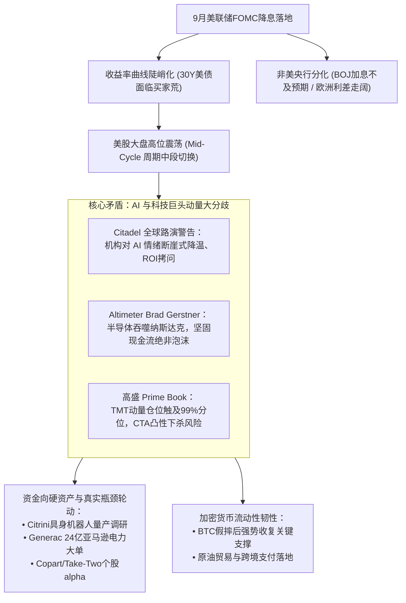
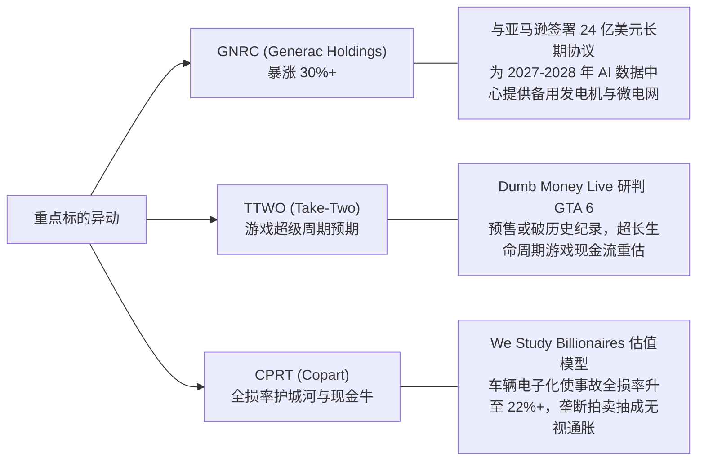

# Market Weekly 宏观与全市场投资周报
**覆盖周期**：2026.09.13 — 2026.09.20  
**数据源规模**：Market 文件夹 42 项深度内容（38 个全球宏观/技术/个股视频播客 + 4 篇顶级机构长文研报）  
**分析架构**：Map-Reduce 双层抽取聚合 | 精准时间戳视频抽帧与原生研报图表协同引用

---

## Executive Summary：本周市场全景与核心主线

过去一周是全球宏观流动性与科技产业叙事剧烈碰撞的“关键决断周”。美联储 9 月 FOMC 决议正式落地，然而降息并未带来无差别的狂欢，反而触发了深层次的跨资产结构重构：

---

## 一、 全球央行沙盘与主权债务流动性断层

### 1. 9月 FOMC 决议落地：降息路径与终点利率博弈
美联储本周正式开启降息周期，市场将其视为新周期的起点。美联储前高级交易员 **Joseph Wang**（[September 2026 FOMC Debrief](https://www.youtube.com/watch?v=AeZskmC_MrM)）指出：
- **点阵图与终点利率**：美联储官员对中性利率的预估持续上移，终点利率区间基本锚定在 **3.0% - 3.25%**，这意味着本轮降息是预防性而非衰退性降息。
- **摩根士丹利视角**：Morgan Stanley 在 [Why the Fed May Have Further to Go](https://www.youtube.com/watch?v=W2U5lAksLfw) 中强调，美国劳动力市场展现出的韧性与核心服务通胀粘性，意味着政策利率依然有更长时间维持在限制性区间（Higher-for-Longer）的必要性，市场对快速深度降息的预期过于激进。

### 2. 美债 30 年期的“买家荒”与期限溢价重构
美联储降息的同时，长端美债收益率并未顺畅下行，反而在供给压力下显现疲态。**The Monetary Matters Network** 专访 Trojan Wealth 创始人 **David Busch**（[Why The 30-Year Treasury Lost Its Biggest Buyers](https://www.youtube.com/watch?v=afFbc9ihr3k)）提供了极具洞察力的解释：

  
*图 1：David Busch 在专访中详解 30 年期美债需求失衡（[点击跳转视频 02:30 处](https://www.youtube.com/watch?v=afFbc9ihr3k&t=150s)）*

- **官方储备买家战略性撤退**：过去二十年消化美国长端国债的最大主力——外国央行与主权基金，由于去美元化与本币贬值防御压力，已显著削减对 30 年期长债的单向增持；
- **私人资本要求更高的期限溢价（Term Premium）**：在年均超 1.8 万亿美元联邦财政赤字的债务海啸下，养老金与保险基金无法填补缺口，导致长端收益率曲线被动陡峭化（Bear Steepening）。

### 3. 非美央行分歧：日元套息余波与欧洲政治风险
在 [Markets Weekly September 19, 2026](https://www.youtube.com/watch?v=WnMDoth8dNs) 中，Joseph Wang 梳理了海外宏观风险：

| 地区/机构 | 动态要点 | 核心影响与市场传导 | 对应视频切片 |
| :--- | :--- | :--- | :---: |
| **日本央行 (BOJ)** | 植田和男维持利率不变，表态谨慎，弱化近期连续加息预期 | 日元反弹受阻，前期剧烈平仓的日元套息交易（Carry Trade）暂时进入休整期，全球流动性未现二次休克 | [查看 01:15 切片](https://www.youtube.com/watch?v=WnMDoth8dNs&t=75s) |
| **英国央行 (BOE)** | 微调量化紧缩（QT）步伐，按兵不动维持基准利率 | 英国服务业通胀粘性迫使央行维持高压，英镑兑美元相对坚挺 | [查看 05:03 切片](https://www.youtube.com/watch?v=WnMDoth8dNs&t=303s) |
| **欧洲法国债市** | 法国政局与财政预算赤字分歧加剧，法德 10 年期国债利差（OAT-Bund Spread）持续走阔 | 欧洲边缘与核心主权信用风险重新定价，防守性资金向美德国债及黄金回流 | [查看 09:30 切片](https://www.youtube.com/watch?v=WnMDoth8dNs&t=570s) |

 

 
<em>图 2：Joseph Wang 深入拆解法德国债利差扩大背后的欧洲主权信用风险（<a href="https://www.youtube.com/watch?v=WnMDoth8dNs&t=570s">视频 09:30 处实景</a>）</em>

---

## 二、 美股风暴眼：AI 情绪大分歧与科技股动量断裂

过去一周，资本市场对于 AI 与科技巨头资本开支（Capex）的争论进入了白热化阶段。顶级对冲基金、一级市场教父与量化流向机构给出了截然相反但极具价值的信息。

### 1. 冰点警示：Citadel Securities 全球路演纪要
**Citadel Securities** 官方发布的半月度全球市场情报 [2H September: Getting Closer](https://www.citadelsecurities.com/news-and-insights/global-market-intelligence/2h-september-getting-closer/) 释放了近期最明确的看空信号：
> *“我目前正在进行多国全球机构投资者路演，我所观察到的最显著变化，是市场对 AI 的情绪降温得如此迅速（how quickly sentiment around AI has turned negative）。”*

Citadel 总结了机构投资者的三大转变：
1. **从算力军备竞赛转向资本回报率（ROI）审查**：大客户对超大规模云厂商（Hyperscalers）动辄数百亿美元的折旧压力愈发警惕，缺乏直接变现闭环的应用层正在遭遇严厉估值折价；
2. **流量与商业模式受到蚕食**：通用搜索、广告与传统 SaaS 受到 AI Agent 分流的防御性风险开始显现；
3. **持仓拥挤度风险释放**：巨头财报不再能轻易满足近乎完美的盈利预期，宏观降息落地反而成了部分长线资金获利了结的触发器。

### 2. 多头回击：Altimeter Brad Gerstner 坚称“绝非泡沫”
而在本周备受瞩目的 **All-In Summit 2026** 上，Altimeter 创始人 **Brad Gerstner**（[Brad Gerstner: No AI Bubble, Semis Eat the Nasdaq](https://www.youtube.com/watch?v=PJrntzMA4iQ)）登台力驳“AI 泡沫说”：

  
*图 3：Brad Gerstner 展示 Altimeter 全球宏观与科技演进沙盘（[点击跳转视频 02:00 处](https://www.youtube.com/watch?v=PJrntzMA4iQ&t=120s)）*

- **半导体正在吞噬纳斯达克（Semis Eat the Nasdaq）**：半导体行业占纳斯达克综合指数盈利的比重大幅飙升，这不是当年互联网泡沫时期的虚假眼球经济，而是真实产生数百亿美元自由现金流的刚性实体投资；
- **智能起飞拐点（Take-Off Problem）**：尽管硬件端先行，软件层部署存在 1-2 年的时间滞后，但这正是历史上所有超级平台级技术（如个人电脑、移动互联网）的必经周期，放慢预期反而是长期复合投资者的最佳介入窗口。

### 3. 微观量化流向异动：高盛 Prime Book 与 Market Ear 预警
专业机构流向跟踪平台 **market ear**（[Momentum Breaks, CTA Downside Convexity Builds](https://themarketear.com)）通过高盛主经纪商业务（GS Prime Brokerage）的数据揭示了科技股内部潜在的筹码结构风险：

| 指标维度 | 监测数据表现 | 市场隐含含义 |
| :--- | :--- | :--- |
| **GS TMT 动量多头流入** | 过去两周多头交易流飙升至历史 **99% 分位数**（见图 4） | 避险买盘将科技七巨头当做“确定性流动性避风港”，持仓高度拥挤 |
| **TMT 动量波动率 (GSTMTMOM)** | 200 天波动率指数狂飙至 **76.05**，而标普仅为 13.06（见图 5） | 动量板块内部结构剧烈分化，龙头股稍有不及预期即引发多杀多踩踏 |
| **CTA 仓位与回购暗影** | 趋势跟踪基金（CTA）下行凸性形成，且正值企业财报前回购静默期 | 一旦跌破关键技术均线，缺乏企业回购护盘的空窗期将放大下行跌幅 |

 

 
<em>图 4 & 图 5：高盛 Prime Book 监测显示 TMT 动量仓位触及 99% 极值（左）与 TMT 波动率创历史新高（右）</em>

---

## 三、 产业深度调研与焦点个股精粹

在宏观大盘高位震荡的背景下，资金从虚浮的叙事类标的，快速向具备**实际供应链物理交付能力**的硬科技与低估值价值个股集中。

### 1. Citrini Research 重磅实地调研：具身智能与机器人的“奇点前夜”
顶级独立研究机构 **Citrini Research** 发表了长达 3.6 万字的产业实地考察报告 [Robotics Tipping Point: A Citrini Field Trip](https://citriniresearch.substack.com/p/robotics-tipping-point-a-citrini-field-trip)：

  
*图 6：Citrini Research 深入机器人工程车间，实拍灵巧手与高扭矩执行器部件*

- **硬件供应链瓶颈与突破**：当前人形机器人的最大物理瓶颈依然是**灵巧手执行器（Actuators）**、**微型谐波减速器（Harmonic Drives）**以及**六维力矩传感器**。中国与日本的高精度机械加工供应链正将单一关节执行器成本从数千美元压缩至百美元级；
- **视觉模型从仿真进入物理落地**：结合端到端视觉语言动作模型（VLA），人形机器人在特斯拉工厂及 3C 制造装配线上的泛化操作成功率（Success Rate）在过去 6 个月内从 70% 跃升至 95% 以上，跨过了工业化商业闭环的阈值；
- **投资机会映射**：最确定性的 Alpha 不在终局未定的机器人本体整机厂，而在于拥有极致加工精度的伺服减速器龙头、无框力矩电机与高性能微型轴承厂商。

### 2. 焦点个股异动复盘

- **Generac (GNRC) —— AI 算力尽头是电力的最新实证**：
  - Seeking Alpha（[Amazon Supercharges Generac](https://www.youtube.com/watch?v=d_cGhNN7kZI)）报道，GNRC 与亚马逊云科技（AWS）达成 24 亿美元长期发电机组独家供应协议，专供未来新建超算数据中心。市场对电力短缺的焦虑正式转化为二线电力装备龙头的确定性订单。
- **Take-Two Interactive (TTWO) —— 确定性催化剂**：
  - Dumb Money Live（[GTA 6 Has Me Buying Take-Two](https://www.youtube.com/watch?v=nt_-lnlGmgU)）探讨了当前游戏产业周期。随着 GTA 6 官方宣发窗口临近，游戏预售收入有望打破行业历史极值，成为消费电子与互动娱乐板块唯一的避风港。
- **Copart (CPRT) —— 永续复利机器**：
  - We Study Billionaires（[Copart Stock: Is CPRT now a Buy?](https://www.youtube.com/watch?v=2TenulJCKVQ)）深度剖析了全美最大报废车拍卖平台的商业模式：现代汽车传感器与芯片密集度增加，导致轻微碰撞的“全损率（Total Loss Rate）”从 15% 攀升至 22% 以上，保险公司更倾向于全额赔付后委托 Copart 拍卖残值，赋予其极强的抗周期定价权。

---

## 四、 加密资产与另类流动性传导

加密市场在经历前期的深度回调后，本周展现出强劲的量化技术面修复韧性。

### 1. 比特币空头陷阱确认：TechnicalRoundup 盘面解读
知名交易播客 **TechnicalRoundup**（[Bitcoin Bears Had Their Chance](https://www.youtube.com/watch?v=1e2J5t5frSo)）通过 TradingView 日线图表指出，比特币空头错失了最佳击杀窗口：

  
*图 7：CryptoDonAlt 在视频中展示 BTC 跌破震荡区间下沿后的强势放量收复（[视频 02:00 处](https://www.youtube.com/watch?v=1e2J5t5frSo&t=120s)）*

- **假跌破与流动性掠夺（SFP）**：BTC 在下探关键心理关口后迅速回升收复，形成典型的“熊市陷阱”，吸收了前期追空资金的流动性；
- **均线系统重回多头主导**：日线与周线实体重新站上成交量加权密集区，技术上打开了向区间上沿轮动的空间。

### 2. 宏观叙事实体化：原油结算与流动性回流
在 **1000x** 播客（[Crypto Is Used To Buy Oil?! FED Meeting, And Economy Ripping](https://www.youtube.com/watch?v=9pZhmQSroD4)）中，主讲人探讨了美联储降息对风险资产流动性的实际泵压，以及中东与新兴市场在能源贸易结算中利用稳定币避开制裁与银行清算延迟的实际落地案例，数字资产的主权级用例正在超越单纯的投机杠杆。

---

## 五、 专业交易系统、盘面量化与心态心法

针对当前宽幅震荡的大盘环境，多位顶级实盘交易导师在视频中传授了其核心风险控制与执行体系。

### 1. Brian Shannon (AlphaTrends)：多周期锚定 VWAP 策略
技术分析权威 **Brian Shannon**（[Stock Market & Crypto Analysis for Week Ending 9/18/26](https://www.youtube.com/watch?v=NxU_Fn0IJ7M)）公布了本周全市场综合仪表盘：

  
*图 8：Brian Shannon 展示截至 2026.09.18 标普、纳指、半导体、原油与比特币的多空强弱矩阵（[视频 01:30 处](https://www.youtube.com/watch?v=NxU_Fn0IJ7M&t=90s)）*

- **AVWAP 关键位法则**：从 8 月波段低点锚定的成交量加权平均价（Anchored VWAP）已成为全市场主力的第一生命线。标普 500 与纳斯达克虽显滞涨，但只要维持在关键 AVWAP 上方，中长期第二阶段（Stage 2）上升趋势仍未遭破坏。

### 2. Mike Webster：遭遇“放量重挫（Bad Breaks）”的逃生铁律
传奇投资人欧奈尔（William O'Neil）核心搭档、原机构投资组合经理 **Mike Webster**（[WRO #89 Bad Breaks](https://www.youtube.com/watch?v=jmg7N8guZ2k)）强调了保住资本的重要性：

  
*图 9：Mike Webster 在 O'Neil Portfolio 监控表中解析机构资金集中抛盘特征（[视频 03:00 处](https://www.youtube.com/watch?v=jmg7N8guZ2k&t=180s)）*

- **定义 Bad Break**：当某只重仓股在没有明显预警的情况下出现破位大阴线或跌破 21 天/50 天关键均线（伴随放大 1.5 倍以上的量能），这 100% 代表机构正在无情出逃；
- **纪律高于分析**：不要试图在当天给重挫找“基本面合理借口”，立刻减仓 50% 至全清。先退场观望，永远好于在持续套牢中被动承受 30%-50% 的回撤。

### 3. David Gardner (Motley Fool 联合创始人)：拥抱亏损的幂律哲学
在 [Why you should aim to lose money in the market](https://www.youtube.com/watch?v=EHu58XJMd4I) 专访中，David Gardner 揭示了长线多头投资的真谛：
- **公共市场的风投思维**：在过去 30 年的卓越投资生涯中，他看错并亏损的个股数量超过了任何人；但投资组合的全部超额收益，来自于极少数实现了 50 倍、100 倍增长的伟大企业（如早期的亚马逊、Netflix、英伟达）；
- **不对称收益率模型**：单只股票的最大损失只有 100%，而潜在收益是无穷大。只要不在垃圾股上堆积杠杆，敢于在优秀企业上承受波动，长期胜率将由数学幂律（Power Law）自动保障。

---

## 六、 下周宏观日历与战术沙盘指引

结合本周 42 项内容的综合研判，为下周交易与资产配置提供以下关键指引：

> [!IMPORTANT]
> **1. 仓位防守与风格切换**：
> - 鉴于高盛与 Citadel 披露的 AI 估值争论与 TMT 拥挤度极值，建议减少对无盈利支撑的高估值 SaaS/高贝塔芯片概念股的追高操作；
> - 增配具备真实订单落地的“AI 实体基础设施”（如电力电网 Generac、数据中心温控及具身机器人精密轴承/减速器核心龙头）。

> [!TIP]
> **2. 固收与利率久期管理**：
> - 避免在降息初期盲目重仓超长久期美债（TLT/30Y 国债），30 年期美债买家荒与期限溢价抬升将限制长端价格涨幅；
> - 优先选择 2-5 年期中期国债或高质量短久期投资级公司债享受票息收益。

> [!NOTE]
> **3. 交易风控纪律**：
> - 严格执行 Mike Webster 的“Bad Breaks”减仓规则与 Brian Shannon 的 AVWAP 关键位止损。在震荡市中保持充裕现金，等待市场消化完季末机构调仓与回购静默期后再行发力。
